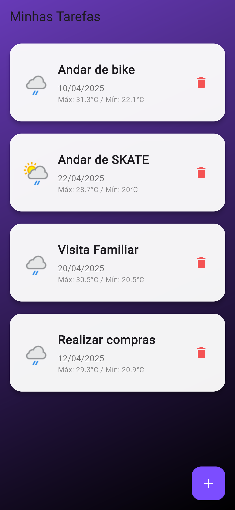

# 📱 Flutter Tasks Weather App

Este é um aplicativo desenvolvido com Flutter para fins acadêmicos. Ele permite o gerenciamento de tarefas com funcionalidades completas de CRUD (Criar, Listar, Atualizar, Deletar), além de integração com a API WeatherAPI para exibir a previsão do tempo baseada na data da tarefa.

---

## 🚀 Funcionalidades

- Criar tarefas com título, descrição e data
- Listar todas as tarefas salvas
- Editar e excluir tarefas
- Visualizar previsão do tempo da data da tarefa (máxima, mínima e condição)
- Armazenamento local com Hive

---

## 🧱 Widgets obrigatórios utilizados

| Widget        | Local de uso                                               |
|---------------|------------------------------------------------------------|
| MaterialApp   | `main.dart` - Entrada principal da aplicação               |
| Scaffold      | Todas as telas: estrutura base de layout                   |
| AppBar        | Todas as telas com título superior                         |
| Card          | `HomeScreen` para exibição das tarefas                     |
| Row           | `HomeScreen`, nas linhas de layout dos detalhes            |
| Icon          | Botões e elementos visuais como lixeira, clima, adicionar |
| Column        | Agrupamento vertical de elementos em todas as telas       |
| Padding       | Espaçamento interno dos componentes principais             |

---

## 🖼️ Demonstração visual

### 🏠 Tela Inicial (Listar tarefas)


### ➕ Criar nova tarefa


### 📝 Editar tarefa existente


### 🔍 Detalhes da Tarefa


---

## 💡 Tecnologias e APIs

- **Flutter** – SDK de desenvolvimento multiplataforma
- **Hive** – Armazenamento local sem necessidade de banco relacional
- **HTTP** – Comunicação com a API de clima
- **WeatherAPI** – Provedor de dados meteorológicos (https://www.weatherapi.com/)

---

## 📁 Estrutura de diretórios

```
lib/
├── main.dart                     # Ponto de entrada
├── models/
│   └── task.dart                # Modelo Hive de tarefa
├── services/
│   ├── task_service.dart       # Lógica CRUD com Hive
│   └── weather_service.dart    # Integração com a WeatherAPI
├── screens/
│   ├── home_screen.dart        # Tela principal com lista de tarefas
│   ├── task_form_screen.dart   # Tela para criar ou editar tarefas
│   └── task_detail_screen.dart # Tela com detalhes e clima da tarefa
```

---

## 🛠️ Como executar o projeto

1. **Clone o repositório:**
```bash
git clone https://github.com/Marceloalvesll/flutter-tasks-weather-app.git
cd flutter-tasks-weather-app
```

2. **Instale as dependências:**
```bash
flutter pub get
```

3. **Execute no navegador ou emulador Android:**
```bash
flutter run -d chrome  # ou use um emulador real com flutter run
```

4. **Adicione sua chave da WeatherAPI:**
   No arquivo `weather_service.dart`, substitua pela sua chave:
```dart
final String apiKey = 'SUA_CHAVE_AQUI';
```

---

## 📄 Licença

Este projeto é de uso educacional e pode ser utilizado livremente para fins acadêmicos.

